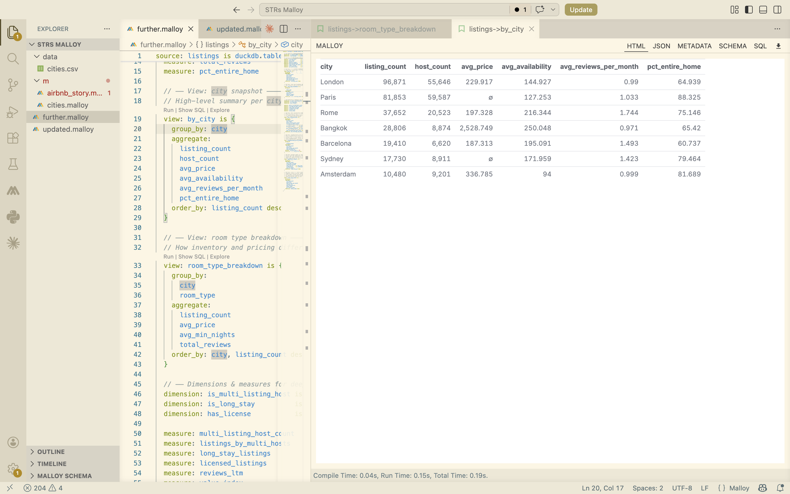

# STRs-Malloy

Within the city snapshot, I found it interesting that Amsterdam had the lowest average availability within a year and did not even hit the hundreds. Meanwhile all of the other cities have at least 127 days. I wonder if there are certain key events that go throughout the year that lead to a lack of availability or if it is a bit skewed due to it having the least amount of listings compared to the other cities. It would be cool to see how the average changes across the years and see if the 94 day average is normal. Barcelona and London ranking the least in the percentage of listings being entire houses at 60.73% and 64.93% was somewhat surprising. I always thought of the Barcelona housing market being run by corporations and non-local investors who buy entire houses or complexes and rent them out to people. 

 In the room breakdown by city, in Rome it is slightly less expensive to rent a private room of a shared house or apartment than a hotel room. I assumed that the shared house type of room would be less expensive since there is less privacy and more people pay into the management fees and rent. I feel like more people would be inclined to get hotel rooms to save money on renting an entire apartment or home but also get the privacy and space compared to shared facilities in shared homes. It was also interesting to note that for Rome’s average minimum nights needed to book a listing for entire homes are shorter at 4.64 compared to the other three types. As a home owner I would want to make sure that the guests are actually serious travelers and that they will use the housing as a home base. However in hindsight it makes sense because owners want to maximize the amount of people who house so they can increase their revenue streams.

For host concentration, London having the most hosts that list multiple properties is kind of fascinating. London is an expensive city and owning and managing multiple properties can be tedious for people who are not professionals. I now wonder of those multi-listers, how many identify as amateur versus professional and to see how many listings are owned by each subgroup of multi-listers. Barcelona having the highest average of listings per multi-host is very telling that a decent amount of people work on an industrial level where they are more like realtors instead of people who happen to own a second property. Although there is no specifics of the level of the multi-listers as previously mentioned.

Within the regulatory signals, Sydney having the highest percentage of listings with (self reporting) statement that it is licensed at 92.36% indicates that Australia has relatively strict STR rules. It means that they require and enforce licensing regularly. I had no idea that Australia could have such good control over STRs where I have seen data and cases of other big countries not having good structure to their rules and permissions regarding rental units.

This data is important to three major groups: policymakers, travelers, and investors. City governments can use host concentration and regulatory signals data to evaluate whether existing short-term rental laws are actually working or being ineffective. Travellers and travel platforms can use the neighbourhood price premium data to make smarter booking decisions. Investors can use host concentration numbers to assess how mature and competitive a short-term rental market is before entering it.
